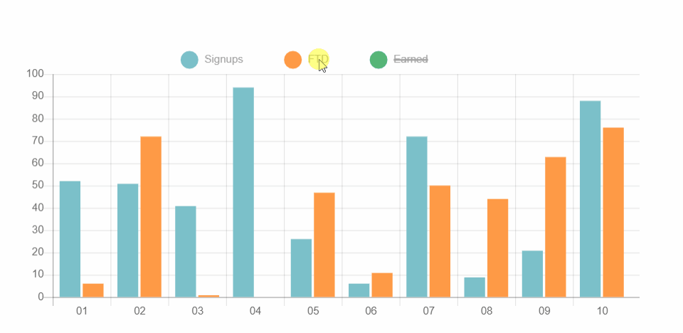

<p align="center">
</a>
</p>
<br>
  
# Just do it - Dashboard panel

The project assumed the preparation (based on the view provided by the graphic designer) of a responsive administration panel for the banner and link management system.

[:sparkles: Published version](https://marcela-os.github.io/Just-do-it/dist/)

## Tech Stack

* HTML
* CSS
* JavaScript
* Git

  
## Lessons

* preparation of the correct file structure
* use [normalize.css] (https://necolas.github.io/normalize.css/)
* graphic design analysis - division of the page into sections and components on grounds of common functionality/content
* preparation of the styleguide
* focus on responsiveness of the website and adapt it to different screens
* validation and styling of forms
* build modals (pop-ups)
* creation of an interactive chart using the [Chart.js] (https://www.chartjs.org/) plugin


## Room for Improvement

* development of subpages

  
## Run Locally

Install dependencies

```bash
  npm install
```

Start the server

```bash
  npm run watch
```

  
## Authors

:woman: [@marcelaos](https://github.com/marcela-os)
